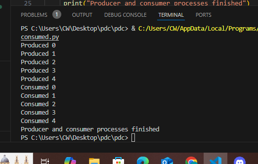
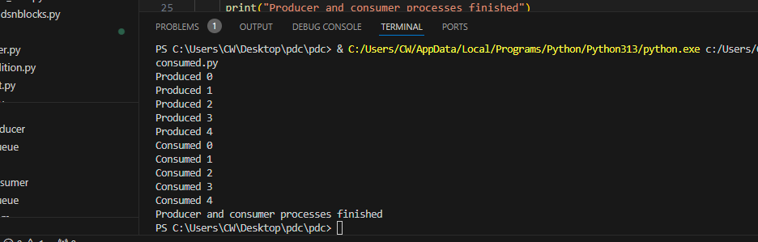

1. Multiprocessing with Producer-Consumer Model
This section demonstrates the use of the multiprocessing library to implement a producer-consumer model. A producer process generates data and places it into a shared Queue, while a consumer process retrieves and processes the data. The Queue ensures safe communication between processes, highlighting how multiprocessing can be used for parallel task execution and inter-process communication.

2. Threading for Fibonacci Calculation
Here, Python's threading module is used to calculate the Fibonacci sequence concurrently across multiple threads. While threads run concurrently, this example demonstrates the limitations of threading for CPU-bound tasks due to the Global Interpreter Lock (GIL), which can restrict true parallelism in Python.

3. Distributed Computing with MPI
Using the mpi4py library, this section showcases distributed computing where processes communicate via message passing. A process with rank 0 sends data to another process with rank 1, illustrating the basics of process communication and coordination in distributed systems.

4. Comparison of Multiprocessing and Multithreading for List Processing
This section compares the performance of multiprocessing and multithreading for a task that involves squaring numbers in a list. It highlights the efficiency of multiprocessing for CPU-bound tasks and the role of threading in scenarios where lightweight concurrency is needed.

5. Thread Management with ThreadPoolExecutor
The ThreadPoolExecutor is used to simplify thread management by submitting tasks to a thread pool. This example executes two simple tasks concurrently, demonstrating how thread pools can streamline thread-based parallelism.

6. Data Parallelism with NumPy
This section leverages NumPy's internal parallelism for efficient vector addition. By utilizing NumPy's optimized operations, it demonstrates the power of data parallelism for computationally intensive tasks, achieving significant performance improvements over manual implementations. 

